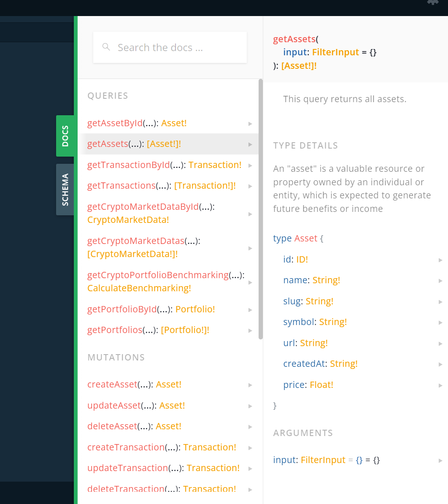

# Portfolio Performance Tracker

## Problem Statement

You are tasked with creating a backend system that allows users to construct and track the performance of their portfolios based on a smart contract, similar to the concept of an "Amulet Vault."

The system should provide an API for users to input portfolio parameters, track the performance of their portfolios relative to another cryptocurrency (e.g., BTC or ETH), and display this information to a frontend application.

## Solution

The backend has been developed using NestJS, a Node.js framework that leverages TypeScript for its simplicity and scalability. Additionally, the application utilizes Mongoose for connecting to the MongoDB database.

To obtain real-time price data and historical price data, the CoinMarketCap API has been used.

Frameworks and Tools Used:

- [NestJS](https://nestjs.com/): A Node.js framework with TypeScript support for building scalable applications.
- [Mongoose](https://mongoosejs.com/): An ODM (Object Data Modeling) library for MongoDB and Node.js.
- [CoinMarketCap API](https://coinmarketcap.com/api/): An API for retrieving cryptocurrency market data.

### Mutations and Queries

1. **Portfolio Management API:** Create a RESTful API endpoint that allows users to create, update, delete portfolios.

   1. Each portfolio should have a unique identifier, a name, and a list of assets with their respective quantities and initial prices at date added to the portfolio.

   ```GraphQL
       # Get All the portfolios, example of the response
       query getPortfolios {
           getPortfolios{
               id # Unique Identifier
               name # Name of the Portfolio
               transactions{
                   id
                   quantity
                   date # Date of Transaction
                   price
                   createdAt
                   asset{
                       name
                       price # Current Price
                   }
               }
           }
       }
   ```

   2. Users should be able to create portfolios with multiple assets in two ways:
      1. Amount-based: specified by amount per token. For example, 1 BTC, 1 ETH, and 1 DOGE.
      ```GraphQL
          mutation createPortfolioBasedAmountToken {
              createPortfolioWithAmountBased(input: {
                  name: "Amount Based Example",
                  transactions: [
                  {
                      asset: BITCOIN,
                      amount: 1
                  },
                  {
                      asset: CARDANO,
                      amount: 20000
                  },
                  {
                      asset: ETHEREUM,
                      amount: 15
                  }
                  ]
              }){
                  id
                  name
                  transactions{
                    id
                    quantity
                    price
                    createdAt
                  }
              }
          }
      ```
      2. Weight-based: specified by weightings. For example, a portfolio with 5 tokens, each with a 20% weight.
      ```GraphQL
        mutation createPortfolioWithWeightBased {
            createPortfolioWithWeightBased(input: {
            name: "Amount Weight Example",
            transactions:[
            {
                asset: ETHEREUM,
                weight: 25
            },
            {
                asset: BITCOIN,
                weight: 25
            },
            {
                asset: SOLANA,
                weight: 25
            },
            {
                asset: RIPPLE,
                weight: 25
            }
            ]
            budget: 3000
        }){
            id
            name
        }
        }
      ```
   3. The API should also be able to retrieve, add, and remove assets from the portfolios.

   ```GraphQL
    # Get Portfolio By Id
    query getPortfolio {
        getPortfolioById(id: "example_id"){
            id
            transactions{
            id
            quantity
            }
        }
    }

    # Get Transactions
    query getTransactions{
        getTransactions{
            id
        }
    }

    # CreatePortfolio
    mutation CreatePortfolio {
        createPortfolio(input: {
            name: "David Bujosa RED One"
        }){
            id
            name
        }
    }

    # Create Single Transaction with Specific date and Price.
    mutation CreateTransaction {
        createTransaction(input: {
            asset: SOLANA,
            quantity: 1,
            price: 158.9
            date: "2021-10-17T17:11:00.000Z",
            portfolio: "6531aed84a506449dc5391d5"
        }){
            id
            quantity
            date
            price
        }
    }

    # Delete Portfolio, also with this you delete all the transactions related with that portfolio
    mutation deletePortfolio{
        deletePortfolio(id: "653303ce85270f766b46d81a"){
            id
            name
        }
    }
   ```

2. **Performance Tracking:**

   1. Implement a mechanism to track the performance of the constructed portfolios relative to another cryptocurrency (e.g., BTC or ETH).
   2. Performance should be calculated based on the current market prices of assets in the portfolio compared to the selected cryptocurrency. This should be in terms of percentage gains/losses.
   3. Calculate the performance of each portfolio over time, taking into account the historical price data of the assets. You can use a suitable performance metric (e.g., [return on investment](https://www.investopedia.com/articles/basics/10/guide-to-calculating-roi.asp)).

   ```GraphQL
    query {
        getCryptoPortfolioBenchmarking(input: {
            portfolio: "ID_OF_THE_PORTFOLIO",
            asset: SOLANA
        }) {
            portfolio{
                id
                totalSpent
                currentBudget
                changeOneHour
                changeOneDay
                changeOneWeek
                changeOneMonth
                changeTwoMonths
                changeThreeMonths
            }
            asset{
                name
                currentPrice
                changeOneHour
                changeOneDay
                changeOneWeek
                changeOneMonth
                changeTwoMonths
                changeThreeMonths
            }
        }
    }
   ```

## Installation

```bash
$ npm install
```

## Running the app

Before running the app, you need to create a .env file with the following varibles (you can use the [.env.example](.env.example) file as a template)

```bash
# development
$ npm run start

# watch mode
$ npm run start:dev
```

When the app is running, you can access the GraphQL Playground in the following URL: http://localhost:3000/graphql

Also see the documentation of the API in the schema tab.



## Test

```bash
# unit tests and integration tests
$ npm run test
```

## Alternative for running the app

```bash
# development
$ docker-compose up
```

## System Requirements

This project requires Node.js version 20.8.1 or higher to run. Make sure you have the correct version of Node.js installed on your system before continuing.
